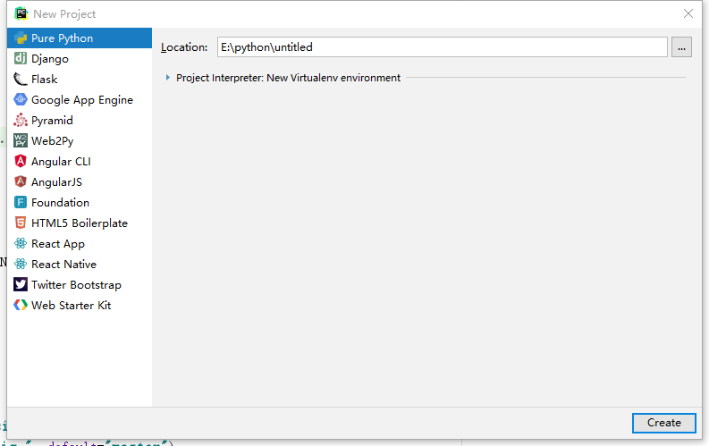

### pycharm profession（专业版） 激活

## JetBrains 授权服务器(License Server URLS):

- http://idea.imsxm.com 

**使用方法：**激活时选择License server 填入http://[idea.imsxm.com](http://idea.imsxm.com/) 点击Active即可  。

how-to-active: when active,type the url in License server address input box,and then press the Active button:)

这个方法已经被禁止掉了，亲测过。怎么办呢？看下面

Banned?download this tool [[idea_active_proxy.exe](http://img.imsxm.com/idea_active_proxy.exe)]
open it and use [http://localhost:8888](http://localhost:8888/) to active JB.when done,you can close it.  (not viable in 2017.3.4 version)

意思就是下载这个idea_active_proxy.exe，实现反向代理，然后把http://idea.imsxm.com 换成 http://localhost:8888 即可。

这样在新建项目的时候就可以看到除了pure Python意外的其他项目了。

